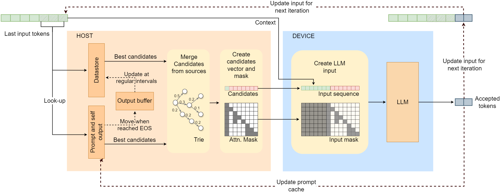

<div align="center">

# SSSD: Simply-Scalable Speculative Decoding

**SSSD is a speculative decoding method for simple, production-ready LLM inference acceleration.**

**Accepted at ACL 2026 (Main Conference)**

[](https://arxiv.org/abs/2411.05894)
[](https://spdx.org/licenses/BSD-3-Clause-Clear.html)

</div>

SSSD is a **training-free** speculative decoding method: instead of relying on an auxiliary draft model, it retrieves candidate continuations from a large suffix-array datastore and from lightweight prompt/self-output caches, merges them into a tree, and verifies them with the target LLM in a single step. This makes it attractive when you want the benefits of speculation without adding a second model to train, deploy, tune, and maintain.

## Why SSSD?

- **No draft model required** — eliminates the need for a separate training pipeline and ongoing draft-model maintenance in production.
- **Well-suited for dynamic workloads** — adapts naturally to shifting tasks, domains, languages, and varying context lengths.
- **Scales with large datastores** — supports multi-GB n-gram retrieval, combining it with prompt and self-output retrieval at sub-millisecond latency.
- **Works out of the box** — no need to pre-curate a datastore; it can grow automatically from real usage over time.
- **Lower latency in practice** — achieves up to **2.9× lower latency** than standard autoregressive decoding in real systems, with comparable or better performance than training-based approaches.

> For **SGLang integration** and to **reproduce the serving results from the paper**, see [huawei-csl/sglang-sssd](https://github.com/huawei-csl/sglang-sssd).

## How SSSD Works

SSSD follows a simple host/device split:

1. Use the last few input tokens to retrieve promising continuations from a large datastore and from the current sequence state.
2. Merge these continuations into a tree on the host side, so multiple candidate branches can share prefixes efficiently.
3. Use the candidates and tree-mask for one speculative verification pass on the target model.
4. Feed accepted output back into the prompt cache and, at a slower cadence, into the live datastore.

<p align="center">
  
</p>

## Quick Start

### 1. Build a datastore

```python
import sssd_speculator

# Toy example:
vocab_size = 128

writer = sssd_speculator.Writer(
    index_file_path="demo.idx",
    vocab_size=vocab_size,
    max_chunk_size=512 * 1024 * 1024,  # default
)

writer.add_entry([1, 2, 3, 4])
writer.add_entry([1, 2, 31, 41])
writer.add_entry([5, 6, 7, 8])
writer.finalize()
```

### 2. Query candidates

```python
reader = sssd_speculator.Reader(
    index_file_path="demo.idx",
    vocab_size=vocab_size,
)

output_ids, depths, masks = reader.get_candidates(
    prefixes=[[1, 2], [5, 6]],
    decoding_lengths=[8, 8],
    branch_lengths=[3, 3],
    seq_ids=[0, 1],
)
```

What comes back:

- `output_ids[i]` is a flattened tree of candidate tokens.
- `output_ids[i][0]` is always the last token of `prefixes[i]` and acts as the root token.
- `depths[i]` aligns with `output_ids[i]`; the root token has depth `0`.
- `masks[i]` is a NumPy `bool` array with shape `(len(output_ids[i]) - 1, len(output_ids[i]) - 1)`. The root token is not included in this mask.

### 3. Mix in prompt and self-output context

```python
reader.sync_put([101, 42, 7, 9], seq_id=0)   # prompt tokens
reader.stream_put([13, 14, 15], seq_id=0)    # newly generated tokens

output_ids, depths, masks = reader.get_candidates(
    prefixes=[[7, 9], [14]],
    decoding_lengths=[8, 8],
    branch_lengths=[3, 3],
    seq_ids=[0, 0],
)

reader.sync_finish_sequence(0)
```

Use a stable `seq_id` for the lifetime of a sequence. If your generation batch shrinks over time, do not renumber survivors.

## Where To Look Next

- Use [`datastore_creation/create_datastore.py`](datastore_creation/create_datastore.py) to build larger `.idx` files from Hugging Face datasets, `.npz` files, or `.jsonl` corpora.
- Use [`evaluation/`](evaluation) to compare SSSD against PIA/Lookahead, REST, and the adapted REST baseline on offline traces.
- Use [huawei-csl/sglang-sssd](https://github.com/huawei-csl/sglang-sssd) if your goal is deployment inside SGLang or reproducing the paper's serving experiments.

<details>
<summary><strong>Installation Details</strong></summary>

From the repository root:

```bash
pip install -e .
```

Build notes:

- The extension is compiled with CMake and `pybind11`.
- The CMake build fetches `libsais` and `spdlog` during configure, so a working compiler, CMake, and build-time network access are required.
- The current CMake configuration searches for Python `3.9` through `3.12`.

If your environment is missing native toolchain/runtime pieces, this usually fixes it:

```bash
conda install -c conda-forge gcc_linux-64 gxx_linux-64 libstdcxx-ng
```

</details>

<details>
<summary><strong>Exact API And Configuration Reference</strong></summary>

### `Writer(...)`

| Parameter | Default | Meaning |
| --- | --- | --- |
| `index_file_path` | required | Datastore path. If the file already exists, new entries are appended to it. |
| `vocab_size` | required | Alphabet size passed to suffix-array construction. It must be greater than every stored token id. |
| `max_chunk_size` | `512 * 1024 * 1024` | Maximum number of tokens per chunk. Each chunk becomes one suffix-array sub-index. |

Methods:

- `add_entry(tokenized_sentence)`: Adds one tokenized sequence. A single entry cannot be larger than `max_chunk_size`.
- `finalize()`: Flushes the buffered chunk and writes its suffix array to disk. The destructor also finalizes, but calling it explicitly is the safest way to make the file immediately usable.

### `Reader(...)`

| Parameter | Default | Meaning |
| --- | --- | --- |
| `index_file_path` | required | Path to a `.idx` datastore. Pass `""` to run without a fixed datastore. |
| `stop_token` | `-1` | If this token is encountered while building datastore continuations, the continuation stops there. Useful when your stored entries contain explicit boundary tokens. |
| `max_search_entries` | `100` | Global search budget across all loaded datastore chunks. Internally it is redistributed across sub-indexes roughly in proportion to their size. |
| `prompt_branch_length` | `8` | Maximum branch length inserted into the in-memory prompt/self-output trie. |
| `prompt_prefix_length` | `3` | Prefix length used when matching against the prompt/self-output trie. The reader can still fall back to shorter suffixes of the query. |
| `max_output_size` | `256` | Preallocation hint for per-sequence generated output storage. It does not need to be exact. |
| `live_datastore` | `False` | Enables background updates of a live datastore built from finished sequences. |
| `max_update_chunk_size` | `512 * 1024 * 1024` | Chunk size used by the live datastore updater. Smaller values create more chunks and are mainly useful for testing or experimentation. |
| `max_indices` | `8` | Maximum number of datastore chunks kept in memory. When the limit is exceeded, the oldest chunks are dropped. |
| `update_interval_ms` | `20 * 60 * 1000` | Target interval between live datastore update passes. |
| `vocab_size` | `300_000` | Vocabulary bound used for live datastore construction and for on-disk compatibility checks. Internally the reader adds a small safety margin. |
| `max_batch_size` | `256` | Initial preallocation hint for batched retrieval. If you exceed it, the reader grows its internal buffers instead of failing. |
| `prompt_tokens_in_datastore` | `3` | Number of trailing prompt tokens prepended to the generated output when a finished sequence is queued for live datastore updates. |

Core methods:

| Method | What it does |
| --- | --- |
| `get_candidates(prefixes, decoding_lengths, branch_lengths, seq_ids)` | Returns `candidates`, `depths`, and boolean masks for the standard tree layout. `decoding_lengths` and `branch_lengths` are per-sequence lists, not scalars. |
| `get_candidates_sglang(prefixes, decoding_lengths, branch_lengths, max_topks, seq_ids)` | Returns an SGLang-oriented BFS layout: `candidates`, `depths`, `firstChildIdx`, `nextSiblingIdx`, and boolean masks. Here the mask size is `n x n`, with `n == len(candidates[i])`. |
| `put(input, seq_id)` | Asynchronously inserts prompt tokens for one sequence. |
| `sync_put(input, seq_id)` | Synchronous version of `put(...)`. |
| `stream_put(new_tokens, seq_id)` | Appends newly generated tokens to a sequence's self-output cache. |
| `batched_stream_put([(tokens, seq_id), ...])` | Batched version of `stream_put(...)`. |
| `finish_sequence(seq_id)` | Asynchronously clears a sequence. With `live_datastore=True`, it also queues the collected output for live datastore indexing. |
| `sync_finish_sequence(seq_id)` | Synchronous version of `finish_sequence(...)`. |
| `finish_all()` | Clears all prompt/self-output state. This is a reset, not a live-datastore flush. |
| `save_datastore(path)` | Saves the current datastore to disk asynchronously. |
| `set_update_pause_flag(flag)` | Pauses or resumes live datastore background updates. |
| `print_indexes()` | Debug helper for toy examples. |

</details>

<details>
<summary><strong>Operational Notes And Edge Cases</strong></summary>

- `vocab_size` must be strictly larger than the maximum token id in the datastore.
- If `vocab_size <= 65536`, tokens are stored on disk as 16-bit values, otherwise 32-bits per token are used.
- Reopening `Writer` on the same file appends new data. If the last chunk is not full, the writer resumes that chunk and rebuilds its suffix array in place.
- `put(...)` is asynchronous. If you need prompt information to be available immediately, use `sync_put(...)`.
- `stream_put(...)` can be called without a prior `put(...)`; the sequence will still be created.
- A sequence reaches the live datastore only when you call `finish_sequence(...)` or `sync_finish_sequence(...)`.
- `finish_all()` only clears active prompt/self-output state. It does **not** queue every active sequence into the live datastore.
- If `set_update_pause_flag(True)` is active, finishing a sequence clears it but does not buffer it for a later live-datastore update.
- `save_datastore(path)` writes in a detached background thread. If you want to reopen the saved file immediately, wait for the write to finish before loading it.
- If a previous `save_datastore(...)` call is still running, a new save request is discarded.
- `branch_lengths` in `get_candidates(...)` limit how many tokens are harvested from each datastore match. The final returned tree is additionally capped by `decoding_lengths`.
- `index_file_path=""` with `live_datastore=False` gives you prompt/self-output-only retrieval. With `live_datastore=True`, the reader starts with an empty datastore that learns from finished sequences.
- The prompt cache and the fixed/live datastore are complementary. If both are enabled, candidate trees are built from all available sources.
- Use the `.idx` extension for datastore files. The reader validates it when loading from disk.
- The tests in `test/test.py` are a good place to look for concrete usage patterns, including prompt-only mode, live-datastore mode, and SGLang output formatting.

</details>

## Paper

Paper: [SSSD: Simply-Scalable Speculative Decoding](https://arxiv.org/abs/2411.05894)

Accepted at **ACL 2026 (Main Conference)**.

**BibTeX**

```bibtex
@misc{marzollo2026sssdsimplyscalablespeculativedecoding,
      title={SSSD: Simply-Scalable Speculative Decoding},
      author={Michele Marzollo and Jiawei Zhuang and Niklas Roemer and Niklas Zwingenberger and Lorenz K. Muller and Lukas Cavigelli},
      year={2026},
      eprint={2411.05894},
      archivePrefix={arXiv},
      primaryClass={cs.CL},
      url={https://arxiv.org/abs/2411.05894},
}
```

## Acknowledgments

Our code makes use of the following open source projects:

- [libsais](https://github.com/IlyaGrebnov/libsais) by Ilya Grebnov
- [ThreadPool](https://github.com/progschj/ThreadPool) by Jakob Progsch and Václav Zeman

Our work also draws inspiration from [REST](https://github.com/FasterDecoding/REST/tree/main) and [PIA](https://github.com/alipay/PainlessInferenceAcceleration/tree/main).

## License

The SSSD source code (`sssd_speculator/`, `datastore_creation/`, `test/`, and the
top-level package files) is released under the **BSD 3-Clause Clear License** — see
[`LICENSE.txt`](LICENSE.txt).

The `evaluation/` folder contains third-party code for comparisons that is covered by separate
licenses:

| Path | License | Original source |
|---|---|---|
| `evaluation/REST/` (Python files) | Apache 2.0 | [FasterDecoding/REST](https://github.com/FasterDecoding/REST) |
| `evaluation/REST/DraftRetriever/` | MIT | [FasterDecoding/REST](https://github.com/FasterDecoding/REST) |
| `evaluation/REST/DraftRetriever_adapted/` | MIT | derived from DraftRetriever above |

Each subdirectory contains the full license text in its own `LICENSE` file.
All modifications made to the third-party code are documented in
[`THIRD_PARTY_NOTICES.md`](THIRD_PARTY_NOTICES.md).
